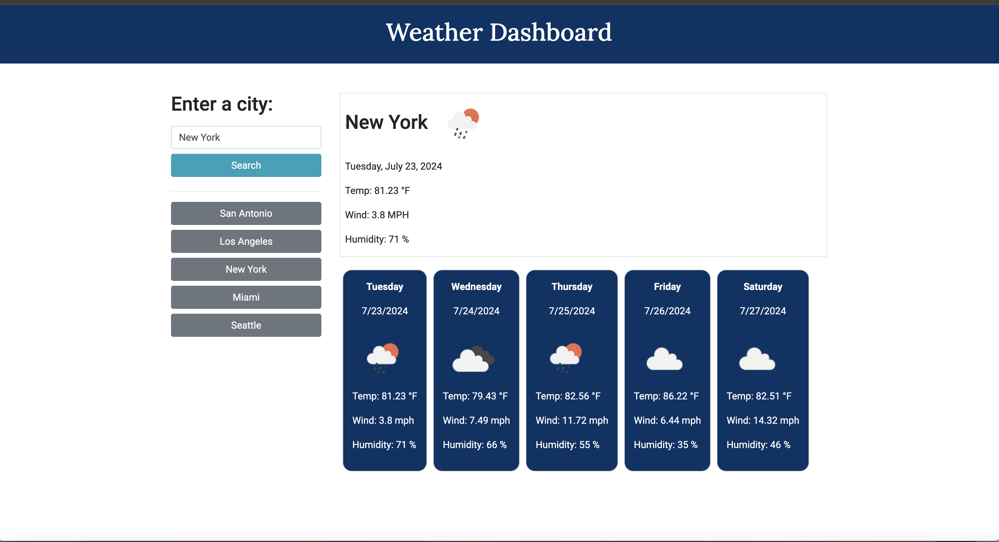

# Challenge 6: Weather Dashboard

## Description

### Weather Dashboard that gives user weather outlook for multiple cities.

- The user enters a search for a city, when the user hits the "search" button they are presented with current and future conditions for that city and that city is added to the search history.
- The user is presented with the current and future weather conditions of the city, the date, an icon representation of weather conditions, the temperature, the humidity, and the wind speed
- The user is presented with a 5-day forecast that displays the date, an icon representation of weather conditions, the temperature, the wind speed, and the humidity
- When the user clicks on a city in the search history they are presented with current and future conditions for that city

## Tasks completed

- Created index.html which loads with placeholder elements until user searches for a city which populates the page.
- Added CSS for styling
- Integrated OpenWeather API, which provides weather data and images for forecast
- Added function that saves previous searches and adds to list

## Installation

To run this project, navigate to:

To view project, navigate to <https://rachelb36.github.io/weather_dashboard/>

## Usage

## Built With

- JQUERY, JS, CSS, HTML
- OpenWeather API <https://openweathermap.org/api>

## Credits

\*\*This project was accomplished with the help provided by the instructors and TAs of the Rice University Coding Bootcamp, including Instructor Darian Mendez, Mateo Wallace, Mark Alfano, Gerard Mennella

Additional resources include:

- <https://bithacker.dev/fetch-weather-openweathermap-api-javascript>

- <https://rapidapi.com/blog/openweathermap-api-overview/javascript/>

- <https://stackoverflow.com/questions/27336622/how-can-i-use-json-jquery-in-api-openweathermap-to-get-weather-information>

- <https://openweathermap.org/api>

## License

Distributed under the MIT License. See LICENSE.txt for more information.
